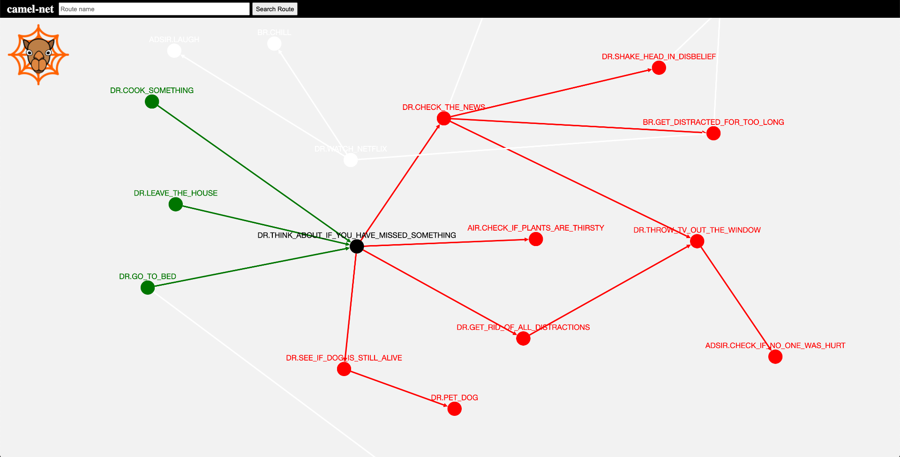

# camel-net

This is an attempt to create visualizations for Apache Camel routes.

The project visualizes dependencies between Camel routes within multiple packages. 
It provides a primitive search for routes and highlights all predecessors and successors of selected nodes inside a graph.

camel-net tries to answer questions to specific challenges when working with Apache Camel. If you have more ideas about challenges that could be solved with this kind of an approach (or similar), please let me know.

# Built with

* Deno (https://deno.land/)
* Cytoscape.js (https://js.cytoscape.org/)
* Angular (https://angular.io/)

# Demo

# Getting started

1. Clone this repository
2. Copy all your Java classes containing Camel routes under `files`
3. Run parser: `/usr/local/bin/deno run --allow-read --allow-write --allow-run parse.ts`
4. Install all npm dependencies: `npm i`
5. Start server: `npm start`
6. Open `localhost:4200`

# Feature plan

* UI selection of different cytoscape layouts
* ...

# Further Remarks

* Supported until now are .from, .to, .enrich, .wiretap navigations
* Support for routes defined in XML does currently not exist (PR highly appreciated)
