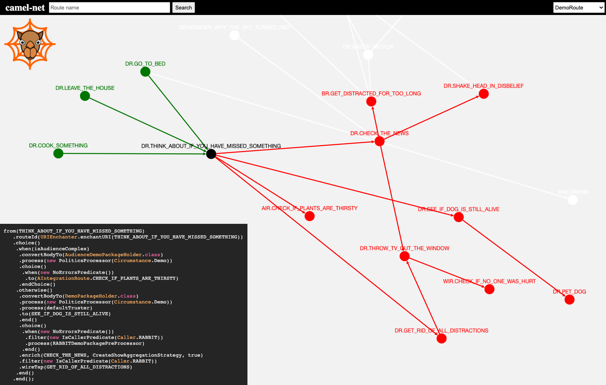

)

# camel-net

This is an attempt to visualize Apache Camel routes.

The project visualizes dependencies between Camel routes across multiple packages across multiple Java files. 

It provides a primitive search for routes and highlights all predecessors and successors of selected nodes inside a graph.

When right-clicking a node inside the visualization, the source code of the route definition will be displayed. This makes it easier to find out which path will be followed.

camel-net tries to answer specific questions about challenges when working with Apache Camel. If you have more ideas about challenges that could be solved with this kind of an approach (or similar), please let me know.

# Built with

* Deno (https://deno.land/)
* Cytoscape.js (https://js.cytoscape.org/)
* Angular (https://angular.io/)

# Demo

Live demo: https://oidamo.de/camel-net/

# Getting started

1. Clone this repository
2. Install Deno (https://deno.land/)
3. Run parser: `npm run parse -- /path/to/your/project`
4. Install all npm dependencies: `npm i`
5. Start server: `npm start`
6. Open `localhost:4200`

# Feature plan

* ProducerTemplates
* UI selection of different cytoscape layouts
* ...

# Further Remarks

* Supported until now are .from, .to, .enrich, .wiretap navigations
* Support for routes defined in XML does not exist (and if nobody has the stamina to create a PR, it never will)
